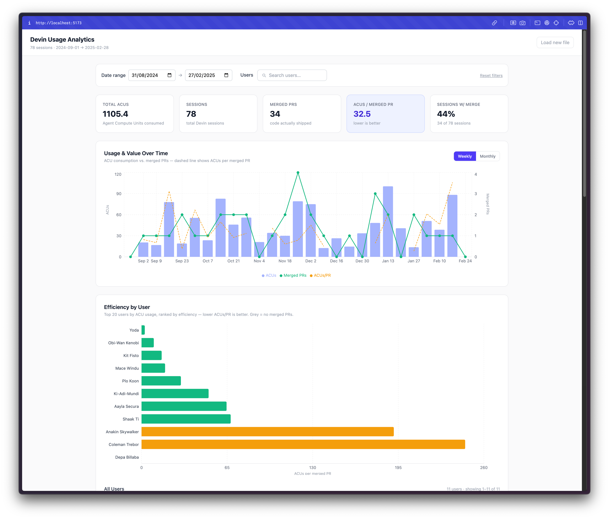

# Devin Usage Analytics

A local, browser-only dashboard for analyzing [Devin](https://devin.ai) AI usage data. Upload your sessions export and immediately answer the core question: **are we shipping more value per ACU, or just spending more?**



## Features

- **KPI cards** — Total ACUs, sessions, merged PRs, ACUs/merged PR, and % sessions with a merge
- **Usage & Value Over Time** — Monthly/weekly bar chart of ACU consumption with merged PR line and efficiency trend (ACUs/PR)
- **Efficiency by User** — Horizontal bar chart of your top 20 ACU consumers, ranked by efficiency; full sortable + paginated table for all users
- **Session Details** — Searchable, sortable, paginated table of every session with PR status badges and direct links
- **Multi-user filter** — Searchable combobox to slice the dashboard to any subset of users (ad-hoc teams)
- **Date range filter** — Narrow to any time window

Everything runs in the browser — no server, no backend, no data leaves your machine.

## Getting Started

### Prerequisites

- Node.js 18+ (tested on v22)
- npm

### Install & run

```bash
git clone https://github.com/your-org/devin-usage-analytics
cd devin-usage-analytics
npm install
npm run dev
```

Open [http://localhost:5173](http://localhost:5173).

### Try it without your own data

Click **"Try with example data →"** on the upload screen to load a fictional Jedi Council dataset (78 sessions, 11 users, 6-month range). It illustrates the full range of the dashboard.

## Using Your Own Data

### Step 1 — Export from Devin

1. Go to **Settings → Analytics → Usaga** in your Devin org, or navigate directly to:
   ```
   https://app.devin.ai/org/{your-org-name}/settings/usage-analytics
   ```
2. Select the **date range** you want to analyze using the dropdown in the top-right corner
3. Click **"Export session data"** (green button, bottom-right of the Sessions section)

This downloads a `.json` file containing all sessions for the selected period.

### Step 2 — Load into the dashboard

Open the app and drop the downloaded file onto the upload zone (or click to browse).

### Expected JSON shape

```json
{
  "date_range": {
    "start": "2025-01-01T00:00:00+00:00",
    "end":   "2025-03-07T00:00:00+00:00"
  },
  "sessions": [
    {
      "user_name":     "Ada Lovelace",
      "user_email":    "ada@example.com",
      "session_name":  "Refactor auth middleware",
      "created_at":    "2025-01-15T10:30:00+00:00",
      "acu_used":      4.2,
      "url":           "https://app.devin.ai/sessions/abc123",
      "org_id":        "my-org",
      "org_name":      "My Org",
      "pull_requests": [
        {
          "pr_url":    "https://github.com/my-org/my-repo/pull/42",
          "pr_status": "merged"
        }
      ]
    }
  ]
}
```

`pr_status` must be one of `"merged"`, `"open"`, or `"closed"`. Sessions with no pull requests are included in ACU totals — intentionally, to surface pure exploration/waste.

## The Core Metric

**ACUs per merged PR** (lower = better) is the primary efficiency signal. It asks: *for every unit of AI compute consumed, how much working code was shipped?*

- A session that produces a merged PR is counted as **value delivered**
- A session with only open/closed PRs or no PRs still consumes ACUs — it appears in totals but not in the denominator
- When a user or period has zero merged PRs, efficiency is shown as `—` (not zero, not infinity)

## Tech Stack

| Layer     | Library                                     |
| --------- | ------------------------------------------- |
| Framework | React 19 + TypeScript                       |
| Build     | Vite 6                                      |
| Styling   | Tailwind CSS v4 (CSS-first, no config file) |
| Charts    | Recharts 2                                  |
| Dates     | date-fns 4                                  |

No backend. No authentication. No external API calls. The only network request is loading `public/example.json` when you click the demo button.

## Project Structure

```
src/
  types.ts                    # All shared interfaces
  App.tsx                     # Root state, useMemo wiring, render gate
  utils/
    dates.ts                  # Bucketing helpers (date-fns)
    metrics.ts                # All aggregation logic
  components/
    FileUpload.tsx             # Drag-drop / file picker + JSON validation
    Filters.tsx               # Date range + multi-user combobox
    SummaryCards.tsx          # 5 KPI cards
    TrendChart.tsx            # ComposedChart: ACUs + merged PRs + efficiency
    UserEfficiencyChart.tsx   # Horizontal bar chart + sortable paginated table
    SessionTable.tsx          # Searchable, sortable, paginated session drill-down
public/
  example.json               # Jedi Council demo dataset (78 sessions)
```

## Build for Production

```bash
npm run build
```

Output is in `dist/` — a fully static site you can serve from any web server or S3 bucket.

## License

MIT
